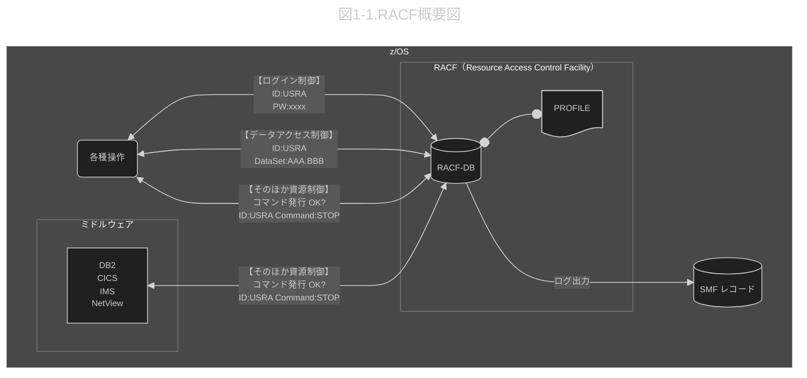
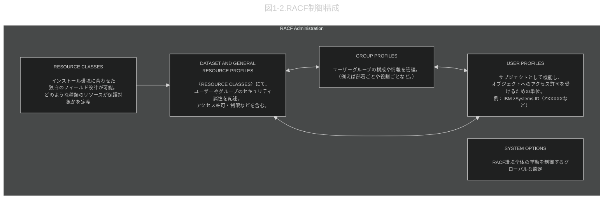

# 0.改定履歴
|No| 日付 | 改定内容                     |
|--|:----:|:---------------------------:|
|1|2025/8/3 |新規作成                    |


# 1.RACF（Resource Access Control Facility） <br>
RACF® は、z/OS® Security Server のコンポーネントです。
z/OS セキュリティー・マネージャーとして、z/OS におけるすべてのアクセス制御の決定を行います。
また、アクセス制御のためにプロファイルとRACFデータベースを使用します。
このデータベースには、リソースへのアクセスを制御するための情報が格納されています。




<br>

# 2.【USER PROFILES】の概要<br>
#### 2-1.基本情報
- RACFでユーザーを識別・管理するための情報をまとめたもの
含まれる情報例：ユーザーID、名前、認証方法、属性、所有者情報など
- CICSなどのサブシステムに関する情報も含まれる

#### 2-2.ユーザー・プロファイル内のセグメント
#### 2-2-1.ユーザープロファイルは下記セグメントに分かれています。

|セグメント種類	|内容概要|
|-------------|--------|
|基本セグメント|IDや認証情報など、RACFでユーザーを定義するための基本情報|
|CICSセグメント|	CICS専用のユーザー関連データ|
|LANGUAGEセグメント|	CICSメッセージの表示言語に関する情報|

#### 2-2-2.基本セグメントの項目（一部）
- LISTUSER コマンドを用いると、ユーザー・プロファイル全体の内容、
またはユーザー・プロファイルの個々のセグメントの内容 をリストできます。
- USERID:ユーザーのID
- NAME:ユーザーの名前
- OWNER:ユーザー・プロファイルの所有者
- DFLTGRP:ユーザーのデフォルト・グループ
- AUTHORITY:デフォルト・グループ内のユーザーの権限
- PASSWORD:ユーザーのパスワード
...etc

#### 2-2-3.LISTUSERの表示結果
```text:
USER=Z77941  NAME=UNKNOWN  OWNER=SYS1      CREATED=25.207
 DEFAULT-GROUP=STUDENTU PASSDATE=25.207 PASS-INTERVAL= 60 PHRASEDATE=N/A
 ATTRIBUTES=NONE
 REVOKE DATE=NONE   RESUME DATE=NONE
 LAST-ACCESS=25.213/19:13:56
 CLASS AUTHORIZATIONS=NONE
 INSTALLATION-DATA=xxx@GMAIL.COM
 NO-MODEL-NAME
 LOGON ALLOWED   (DAYS)          (TIME)
 ---------------------------------------------
 ANYDAY                          ANYTIME
  GROUP=STUDENTX  AUTH=USE      CONNECT-OWNER=SYS1      CONNECT-DATE=25.207
    CONNECTS=   108  UACC=NONE     LAST-CONNECT=25.213/02:14:33
    CONNECT ATTRIBUTES=NONE
    REVOKE DATE=NONE   RESUME DATE=NONE
  GROUP=IZUUSRU   AUTH=USE      CONNECT-OWNER=IBM0001   CONNECT-DATE=25.207
    CONNECTS=    00  UACC=NONE     LAST-CONNECT=UNKNOWN
    CONNECT ATTRIBUTES=NONE
    REVOKE DATE=NONE   RESUME DATE=NONE
SECURITY-LEVEL=NONE SPECIFIED
CATEGORY-AUTHORIZATION
 NONE SPECIFIED
SECURITY-LABEL=NONE SPECIFIED
```

<!-- ********************************************************************** -->

# 3.【GROUP PROFILES】の概要<br>
#### 3-1.基本情報
- ユーザーを役割別にまとめ、同じ権限を付与できる単位
- グループは他のグループを含むこともできる
- 所有者・サブグループ・所属ユーザーの情報を保持
- ユーザーは複数のグループに所属可能

同じ役割や部署のユーザーに共通の権限を一括設定できるため、
アクセスリスト管理が効率的。
ユーザーが役割を離れたら、グループから削除するだけで権限削除が可能

<!-- ********************************************************************** -->

# 4.【RESOURCE CLASSES】<br>
#### 4-1.基本情報
リソース=RACFが保護すべき対象を示しています。
最も代表的なリソースはデータセットですが、
その他にもz/OS UNIXのファイルやディレクトリ、CICSのトランザクション、
Db2のテーブル、さらには特定のシステム操作を実行する権限（FACILITYクラス）といった多種多様な資産がリソースに含まれます。


|クラス名|	対象リソース|	用途例|
|-------|-------------|---------|
|DATASET|	z/OS上のデータセット<br>SYS1.PROCLIB, USERA.TEST.DATA など|	ファイルアクセスの制御|
|z/OS UNIX|/u/usera/file1 といったファイルやディレクトリ|ファイルアクセスの制御
|GENERAL|	任意の名前付きオブジェクト|	アプリケーションレベルの保護など|
|CICSPROD|	CICSトランザクションなど|	CICS環境のセキュリティ管理|
|DB2TABLE|	Db2内のテーブル|	テーブル単位のアクセス管理|
|SERVAUTH|	ネットワークアクセス制御|	TCP/IPポートや接続定義の制御|


<!-- ********************************************************************** -->
<br>

# 5.【DATASET AND GENERAL RESOURCE PROFILES】の概要<br>
#### 5-1.基本情報
RACFのリソースクラスは、保護対象の資源（データセット、CICSトランザクションなど）を分類する枠組み。
各クラスには、アクセス制御を定義する「プロファイル」が含まれています。
アクセス・チェックは、リソース名とプロファイル名の一致によって行われます。


|種類|	内容|
|---|------|
|DATASETプロファイル|	DATASETクラスで定義される。主にデータセット用。|
|一般リソース|	その他すべてのクラス（GENERAL、CICSPRODなど）|


#### 5-2.LD DAコマンド（データセット・プロファイルの表示コマンド）の結果

LISTDSD コマンドは、テープ・データ・セットまたは DASD データ・セットのプロファイルに含まれている情報をリストするために使用します。<br>

#### 5-2-1.コマンド文
```text:
LD DA('Z77941.SECRET') ALL <br>
```
#### 5-2-2.コマンド結果
```text:
INFORMATION FOR DATASET Z77941.SECRET (G)

LEVEL  OWNER    UNIVERSAL ACCESS   WARNING   ERASE
-----  -------- ----------------   -------   -----
 00    Z77941          READ          NO      NO

AUDITING
--------
FAILURES(READ)

NOTIFY
--------
NO USER TO BE NOTIFIED

YOUR ACCESS  CREATION GROUP  DATASET TYPE
-----------  --------------  ------------
   ALTER        STUDENTU       NON-VSAM

NO INSTALLATION DATA

              SECURITY LEVEL
------------------------------------------
NO SECURITY LEVEL

CATEGORIES
----------
NO CATEGORIES

SECLABEL
--------
NO SECLABEL

CREATION DATE  LAST REFERENCE DATE  LAST CHANGE DATE
(DAY) (YEAR)        (DAY) (YEAR)      (DAY) (YEAR)
-------------  -------------------  ----------------
 213    25      NOT APPLICABLE FOR GENERIC PROFILE

ALTER COUNT  CONTROL COUNT  UPDATE COUNT  READ COUNT
-----------  -------------  ------------  ----------
NOT APPLICABLE FOR GENERIC PROFILE

   ID     ACCESS
--------  -------
NO ENTRIES IN STANDARD ACCESS LIST

   ID    ACCESS   CLASS                ENTITY NAME
-------- ------- -------- ----------------------------------------------------
NO ENTRIES IN CONDITIONAL ACCESS LIST
```


#### 5-3.【補足】データセット・プロファイルの作成

#### 5-3-1.データセット・プロファイル作成（保護の定義）のコマンド
```text:
ADDSD 'Z12345.PEABODY.NOTES' UACC(NONE)
```
ADDSDコマンドは、DATASETクラスに属するリソース（データセット）を
保護するために使います。実際には、RACFはADDSDで定義されたプロファイルを
DATASETクラスの一部として登録します。

そのため、ADDSDを使うには、SETROPTS CLASSACT(DATASET)で
DATASETクラスが有効化されている必要があります。

#### 5-3-2.グループに対してREAD権限を与える構文
```text:
PERMIT 'Z12345.PEABODY.NOTES' ID(SHERMAN) ACCESS(READ)
```


<!-- ********************************************************************** -->
<br>
