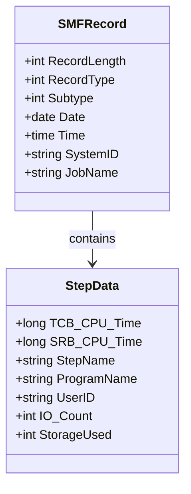

---

# 🧾 SMFタイプ30レコードのbinary解析ガイド

## 概要

SMF（System Management Facilities）タイプ30レコードは、ジョブステップの終了時に記録される情報で、CPU使用量、I/O回数、メモリ使用量などが含まれます。`IFASMFDP`でダンプされたbinary形式のレコードを解析するには、構造とフィールドの意味を理解する必要があります。

---

## 🧠 binary解析の基本ステップ

### 1. レコード構造の理解

SMFレコードは以下のセクションで構成されます：

| セクション         | 内容                                           |
|--------------------|------------------------------------------------|
| SMFヘッダー        | 全レコード共通の基本情報（レコード長、タイプなど） |
| セクションヘッダー | 各サブタイプごとの識別情報                     |
| データセクション   | 実際のリソース使用量やジョブ情報など             |

---

### 2. SMFヘッダーの解析（例：最初の20バイト）

| オフセット | 長さ | 内容               |
|------------|------|--------------------|
| 0          | 2    | レコード長         |
| 2          | 1    | レコードタイプ（30）|
| 3          | 1    | サブタイプ         |
| 4          | 4    | 日付（YYDDMM）     |
| 8          | 4    | 時刻（HHMMSS）     |
| 12         | 4    | システムID         |
| 16         | 4    | ジョブ名など       |

---

### 3. データセクションの代表的フィールド（サブタイプ4）

| オフセット | 長さ | 内容                     | 備考                     |
|------------|------|--------------------------|--------------------------|
| 20         | 8    | TCB CPU時間              | 100ナノ秒単位            |
| 28         | 8    | SRB CPU時間              | 同上                     |
| 36         | 4    | ステップ名               | EBCDIC文字列             |
| 40         | 4    | プログラム名             | EBCDIC文字列             |
| 44         | 4    | ユーザーID               | RACFユーザーIDなど       |
| 48         | 4    | I/Oカウント              | binary整数             |

※オフセットは環境やサブタイプによって異なる場合があります。

---

## 🔍 HEXダンプの読み方（例）

```plaintext
000000  00F0 1E30 2023 0812 1015 30C1 C9C2 D6F1
000010  F0F1 F2F3 F4F5 F6F7 F8F9 4040 4040 4040
```

- `00F0` → レコード長（240バイト）
- `1E` → レコードタイプ（30）
- `30` → サブタイプ（48 = サブタイプ4）
- `2023 0812` → 日付（2023年8月12日）
- `1015` → 時刻（10:15）
- `30C1 C9C2 D6F1` → ジョブ名（EBCDICで "JOBIBM1"）

---

## 🧰 解析に役立つツール

- IBM MVS SMF Record Mapping マニュアル
- HEXエディタ（HxD、ISPF、SPF/PCなど）
- EBCDIC変換ツール（オンラインやPythonライブラリ）
- SMF解析ツール（MXG、SAS、IBM z/OS SMF Explorer）

---

## 📌 補足：IFASMFDPの実行例

```plaintext
//DUMP30   JOB ...
//DUMP     EXEC PGM=IFASMFDP
//SYSPRINT DD SYSOUT=*
//DUMPIN   DD DSN=SYS1.MANx,DISP=SHR
//DUMPOUT  DD SYSOUT=*
//SYSIN    DD *
  INDD(DUMPIN,OPTIONS(DUMP))
  OUTDD(DUMPOUT,TYPE(30))
/*
```

---

## 📎 備考

- EBCDIC文字列の読み取りには変換表が必要です。
- レコード構造はIBMの公式資料に準拠すること。
- サブタイプごとにフィールドの意味が異なるため、目的に応じて選択してください。

---



<br><br><br><br>

# 🧾 HEX、EBCDIC、binaryによるデータの表現方法

---

## 🧠 それぞれの定義

| 用語     | 説明 |
|----------|------|
| **binary（2進数）** | コンピュータが扱う基本的なデータ形式（0と1の列） |
| **HEX（16進数）** | binaryを人間が読みやすくした表現（1バイト＝2桁） |
| **EBCDIC** | IBM系システムで使われる文字コード体系（1文字＝1バイト） |

---

## 🔄 関係性の図解（1バイトの流れ）

```plaintext
[binary] → [HEX] → [EBCDIC文字]
  11000001 →   C1   →     'A'
```

- `11000001`（2進）＝ `C1`（16進）＝ EBCDICでは `'A'`
- 同じbinaryでも、**文字コード体系によって文字の意味が変わる**（ASCIIなら `'Á'`）

---

## 🔍 具体例：ジョブ名 `JOBIBM1`

### EBCDIC文字列 → HEX → binary

| 文字（EBCDIC） | EBCDICコード（16進）->HEX | バイナリ         |
|----------------|----------------------|------------------|
| J              | `D1`                 | `11010001`       |
| O              | `D6`                 | `11010110`       |
| B              | `C2`                 | `11000010`       |

- 実務やSMF解析などの文脈では、「HEX」と言っても**ASCIIのHEXかEBCDICのHEXか**で意味が変わるため、**「EBCDIC HEX」＝EBCDICコードの16進表現**という意図で使われることがあります。
- ただし、**HEXはあくまで数値表現**なので、「EBCDIC」という文字コード体系と混ぜて書くと、意味が曖昧になることも。
このように、「EBCDICコード（16進）」と表記すれば、**「これはEBCDIC体系のコードを16進で表したものです」**という意味が明確になります。

---

## 🧩 HEXとbinaryの変換

| HEX | binary     |
|-----|--------------|
| `00` | `00000000`  |
| `FF` | `11111111`  |
| `2C` | `00101100`  |
| `3A` | `00111010`  |

- HEXは**1桁＝4ビット**、**2桁＝1バイト（8ビット）**
- 例：`2C3A9F80`（HEX）＝ `00101100 00111010 10011111 10000000`（binary）

---

## 🧠 EBCDIC vs ASCII

| 文字 | EBCDIC HEX | ASCII HEX |
|------|------------|-----------|
| A    | `C1`       | `41`      |
| B    | `C2`       | `42`      |
| 1    | `F1`       | `31`      |

- 同じ文字でも**EBCDICとASCIIではHEX値が異なる**
- SMFやz/OSでは**EBCDICが標準**

---

## ✅ まとめ：使い分けと関係

| 表現方法 | 主な用途                     | 読み方のポイント               |
|----------|------------------------------|--------------------------------|
| binary | コンピュータ内部処理         | 0と1の列、直接人間には読みにくい |
| HEX      | binaryの人間向け表現       | 1バイト＝2桁、16進数で読みやすい |
| EBCDIC   | IBM系の文字コード             | HEX値をEBCDIC表に照らして文字に変換 |

---

## 🛠 補足：変換ツール

- **HEX ↔ binary**：電卓やPythonで簡単に変換可能
- **HEX ↔ EBCDIC文字**：IBMの変換表、Pythonの`codecs`ライブラリ（`cp500`など）


