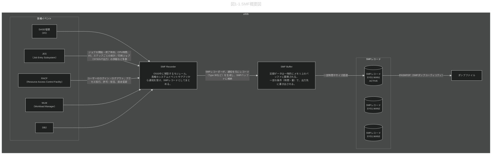

# 0.改定履歴
|No| 日付 | 改定内容                     |
|--|:----:|:---------------------------:|
|1|2025/8/4 |新規作成                    |


# 1.SMF（System Management Facilities） <br>
z/OSのすべての活動（CPU使用率、ジョブ実行、I/O、メモリ使用量など）を記録するロガーのような仕組みです。
SMFは「レコードタイプ（Record Type）」という分類で情報を記録します。
|レコードタイプ|	内容|
|-------------|-------|
|Type 0|	システム起動・終了情報|
|Type 30|	ジョブやタスクの使用状況|
|Type 70|	CPU使用状況|
|Type 72|	WLM（ワークロードマネジメント）|
|Type 80|	RACFのセキュリティログ|




# 2.設定・制御 <br>
SYS1.PARMLIB(SMFPRMxx) メンバーでSMFの動作を制御します
```text:
SYS(TYPE(0:255))         ← すべてのレコードタイプを記録
DSNAME(SYS1.MAN1,SYS1.MAN2)
BUF(MAX(256))
```

IPL（システム起動）時にこれを読み込んでSMFが有効になります。