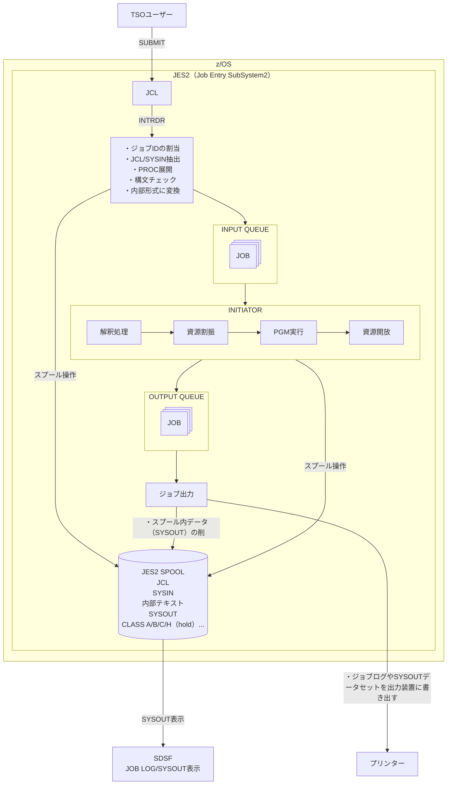

```mermaid
flowchart TD
    TSO[TSOユーザー]
    SDSF[SDSF<br>JOB LOG/SYSOUT表示]
    PRINTER[プリンター]

    subgraph topic[z/OS]
        subgraph JES2[JES2（Job Entry SubSystem2）]
        
        JCL[JCL]
        INTRDR[・ジョブIDの割当<br>・JCL/SYSIN抽出<br>・PROC展開<br>・構文チェック<br>・内部形式に変換]

        subgraph INPUTQ[INPUT QUEUE]
            IJOB@{label: "JOB", shape: processes }
        end

        subgraph INITIATOR[INITIATOR]
            exec1[解釈処理]
            exec2[資源割振]
            exec3[PGM実行]
            exec4[資源開放]

        end

        subgraph OUTPUTQ[OUTPUT QUEUE]
            oJOB@{label: "JOB", shape: processes }
        end

        JOBOUT[ジョブ出力]


        JES2SPOOL[(JES2 SPOOL<br>JCL<br>SYSIN<br>内部テキスト<br>SYSOUT<br>CLASS A/B/C/H（hold）...)]

        end
    end


    %% フロー定義
    exec1 -->exec2
    exec2 -->exec3
    exec3 -->exec4

    TSO -->|SUBMIT| JCL
    JCL --> |INTRDR| INTRDR
    INTRDR -->|スプール操作| JES2SPOOL
    INTRDR --> INPUTQ
    INPUTQ --> INITIATOR
    INITIATOR -->|スプール操作| JES2SPOOL
    INITIATOR --> OUTPUTQ
    JES2SPOOL --->|SYSOUT表示| SDSF
    OUTPUTQ --> JOBOUT
    JOBOUT ---->|・ジョブログやSYSOUTデータセットを出力装置に書き出す| PRINTER
    JOBOUT -->|・スプール内データ（SYSOUT）の削|JES2SPOOL

    %% 下部システム構造
    %% JES2 --> ZOS
```